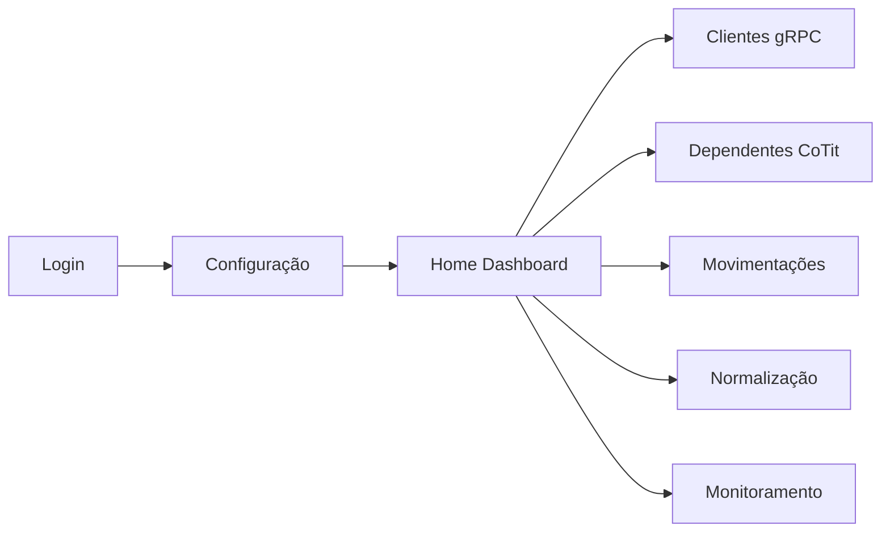

# Diagrama Executivo — Sistema de Telas

## Visão geral
O sistema segue um fluxo autenticado com configuração prévia de ambiente SQL e, depois, acesso aos módulos operacionais e de monitoramento.

## Função de cada tela (resumo)
- **Login**
  - autentica/registre usuário
  - persiste token e sessão
- **Configuração**
  - lê `Advice.xml`
  - seleciona base e valida conexão SQL
  - salva credenciais criptografadas e ativa contexto
- **Home Dashboard**
  - mostra saúde do ambiente e clientes pendentes
  - permite seleção de base e atualização periódica
- **Clientes (gRPC)**
  - dispara geração de clientes em job assíncrono
  - acompanha progresso por SSE/polling
- **Dependentes (CoTit)**
  - executa carga de co-titularidade
  - exibe log operacional da execução
- **Movimentações**
  - gera cargas financeiras por cenário (nacional, ME, intermediador)
  - aplica estratégia de data e filtros
- **Normalização**
  - verifica estrutura SQL
  - cria estrutura/layout quando necessário
- **Monitoramento**
  - consolida KPIs de log, fila e performance de workers
  - auto-refresh em tempo real

## Integrações principais
- **Autenticação**: `/auth/*`
- **Configuração**: `/config/*` e `/user-config/*`
- **Operações de carga**: `/grpc/*`, `/gerar_movimentacoes`, `/executar_carga_cotit`
- **Monitoramento**: `/api/dashboard/*`, `/api/saude-servidor`, `/api/clientes-pendentes`

## Status atual
- Navegação pós-configuração alinhada para dashboard em `/`.
- Execução/testes padronizados por módulo via scripts (`backend:*`, `worker:*`).
