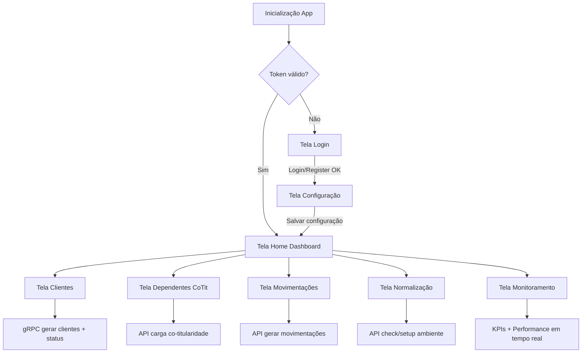

# Diagrama do Sistema por Tela e Funções

## Requisitos funcionais (objetivo das telas)

### Tela Home
- Visualizar dados estatísticos das bases que foram conectadas e identificadas na tela de configuração.

### Telas Clientes, Dependentes e Movimentações
- A geração de dados deve manter as regras de negócio já implantadas.
- Deve reconhecer as bases que foram configuradas e identificadas na tela de configuração.

### Tela Normalização
- Reconhecer a versão do sistema instalada (V8 ou V9).
- Reconhecer as bases que foram configuradas e identificadas na tela de configuração.

### Tela Monitoramento
- Manter a estrutura já implantada.
- Reconhecer as bases identificadas na tela de configuração.

## 1) Fluxo geral de telas (frontend)

## 2) Mapa de funções por tela

### Tela Login
- Arquivo: [frontend-app/src/screens/Login.js](frontend-app/src/screens/Login.js)
- Objetivo:
  - autenticar usuário
  - registrar novo usuário
  - persistir token e dados do usuário no navegador
- Funções da tela:
  - `handleChange`: atualiza campos `username/password`
  - `handleSubmit`: executa login ou registro (`/auth/login` ou `/auth/register`), valida resposta, salva token, redireciona para Configuração
  - troca de modo Login/Registro com botão de alternância
- Endpoints usados:
  - `POST /auth/login`
  - `POST /auth/register`

### Tela Configuração (wizard 4 passos)
- Arquivo: [frontend-app/src/screens/Configuracao_v2.js](frontend-app/src/screens/Configuracao_v2.js)
- Objetivo:
  - localizar Advice.xml
  - selecionar base
  - informar credenciais SQL
  - testar conexão e salvar configuração do usuário
- Funções da tela:
  - `handleCarregarXml`: lê caminho/pasta, busca bases e avança para passo SQL
  - `handleProximoStep`: valida preenchimento mínimo e avança
  - `handleTestarConexao`: testa conexão SQL
  - `handleValidarEAtivar`: salva configuração no backend e conclui wizard
  - componentes visuais internos: `StepIndicator`, `Step1`, `Step2`, `Step3`, `Step4`
- Endpoints usados:
  - `POST /config/listar-bases-pasta`
  - `POST /config/teste`
  - `POST /user-config/save`

### Tela Home (Dashboard de Saúde)
- Arquivo: [frontend-app/src/screens/home.js](frontend-app/src/screens/home.js)
- Objetivo:
  - listar bases salvas pelo usuário
  - selecionar base para monitorar
  - exibir indicadores de saúde e clientes pendentes
  - atualizar automaticamente em intervalo
- Funções da tela:
  - `carregarBases`: carrega bases do usuário
  - `buscarIndicadoresBase`: consulta saúde + clientes pendentes
  - `carregarIndicadores`: atualiza estado da base ativa
  - `selecionarBase`: define base do painel
  - `limparSelecaoBase`: limpa base selecionada
  - filtros de busca na combo e atualização periódica via `setInterval`
- Endpoints usados:
  - `GET /user-config/bases`
  - `POST /api/saude-servidor`
  - `POST /api/clientes-pendentes`

### Tela Clientes (geração via gRPC)
- Arquivo: [frontend-app/src/screens/Clientes.js](frontend-app/src/screens/Clientes.js)
- Objetivo:
  - iniciar job de geração de clientes
  - acompanhar progresso do job por SSE ou polling
  - exibir status percentual e total inserido
- Funções da tela:
  - `startPolling`: consulta status do job periodicamente
  - `startSSE`: acompanha status por stream e cai para polling em fallback
  - `handleGerar`: inicia job com quantidade PF/PJ e armazena `job_id`
- Endpoints usados:
  - `POST /grpc/gerar_clientes`
  - `GET /grpc/job_status/:id`
  - `GET /grpc/job_status/stream/:id`

### Tela Dependentes (Co-Titularidade)
- Arquivo: [frontend-app/src/screens/Cargacotit.js](frontend-app/src/screens/Cargacotit.js)
- Objetivo:
  - executar carga de co-titulares
  - exibir log de execução em tela
- Funções da tela:
  - `adicionarLog`: escreve eventos no console local da tela
  - `executarCarga`: confirma operação, chama API e apresenta resultado
- Endpoints usados:
  - `POST /executar_carga_cotit`

### Tela Movimentações
- Arquivo: [frontend-app/src/screens/Movimentacoes.js](frontend-app/src/screens/Movimentacoes.js)
- Objetivo:
  - gerar movimentações financeiras por cenário
  - controlar estratégia de data e filtro de cliente
- Funções da tela:
  - `handleGerarCarga`: dispara geração com parâmetros escolhidos
  - controle de cenário ativo (`MOVFIN`, `MOVFIN_ME`, `MOVFIN_INTERMEDIADOR`)
  - integração com componente `GeneratorForm` para quantidade
- Endpoints usados:
  - `POST /gerar_movimentacoes`

### Tela Normalização
- Arquivo: [frontend-app/src/screens/Normalizacao.js](frontend-app/src/screens/Normalizacao.js)
- Objetivo:
  - verificar existência da estrutura SQL por layout
  - criar estrutura normalizada quando necessário
- Funções da tela:
  - `verificarStatus`: consulta status de tabelas
  - `executarNormalizacao`: cria/atualiza estrutura do ambiente
- Endpoints usados:
  - `POST /check_ambiente`
  - `POST /setup_ambiente`

### Tela Monitoramento
- Arquivo: [frontend-app/src/screens/Monitoramento.js](frontend-app/src/screens/Monitoramento.js)
- Objetivo:
  - consolidar KPIs e performance dos workers em tempo real
- Funções da tela:
  - composição de três widgets:
    - [frontend-app/src/dashboard/tb_pesquisas_log.js](frontend-app/src/dashboard/tb_pesquisas_log.js)
    - [frontend-app/src/dashboard/tb_fila_adsvc.js](frontend-app/src/dashboard/tb_fila_adsvc.js)
    - [frontend-app/src/dashboard/tb_performance_workers.js](frontend-app/src/dashboard/tb_performance_workers.js)
  - cada widget realiza auto-refresh periódico por `setInterval`
- Endpoints usados:
  - `POST /api/dashboard/log-pesquisas`
  - `POST /api/dashboard/fila-adsvc`
  - `POST /api/dashboard/performance-workers`

## 3) Funções sistêmicas transversais

### App e navegação
- Arquivo: [frontend-app/src/App.js](frontend-app/src/App.js)
- Funções:
  - valida token na inicialização (`/auth/validate-token`)
  - controla sessão autenticada e redirecionamento
  - navbar com logout (`/auth/logout`)
  - roteamento principal das telas

### Contexto de configuração
- Arquivo: [frontend-app/src/context/ConfigContext.js](frontend-app/src/context/ConfigContext.js)
- Funções:
  - manter `configKey`, ambiente e status global
  - expor ações: `validarConfig`, `testarConexao`, `desconectar`

### Serviço de API
- Arquivo: [frontend-app/src/services/apiService.js](frontend-app/src/services/apiService.js)
- Funções:
  - centralizar chamadas HTTP
  - manter `session_id` e `config_key`
  - persistir/recarregar dados de sessão

## 4) Status da rota de retorno ao dashboard
- Ajuste aplicado: em [frontend-app/src/screens/Configuracao_v2.js](frontend-app/src/screens/Configuracao_v2.js), o botão final agora usa `navigate('/')`.
- A rota está alinhada com [frontend-app/src/App.js](frontend-app/src/App.js), que registra o dashboard em `/`.
