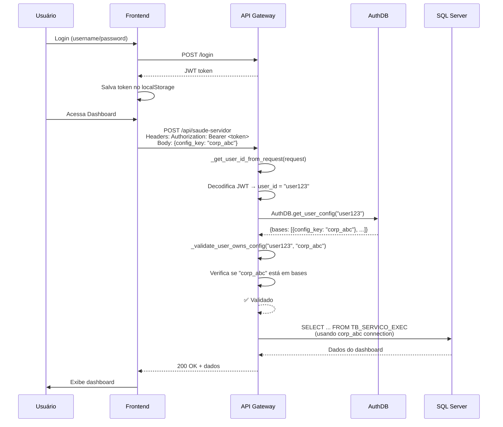

# Isolamento Multi-Usuário - Sistema de Cadastro

## 📋 Visão Geral

Este documento descreve a implementação do sistema de isolamento multi-usuário, garantindo que cada usuário autenticado acesse apenas os dados do seu próprio ambiente configurado.

## 🔐 Arquitetura de Segurança

### Princípios
- **Autenticação**: JWT tokens validam a identidade do usuário
- **Autorização**: Validação de propriedade do `config_key` antes de cada operação de dados
- **Isolamento**: Cada usuário vê apenas bases que configurou

### Fluxo de Validação

```
┌─────────────────┐
│ 1. Request      │
│  + JWT Token    │
│  + config_key   │
└────────┬────────┘
         │
         ▼
┌─────────────────────────────────┐
│ 2. _get_user_id_from_request()  │
│    Extrai user_id do JWT        │
└────────┬────────────────────────┘
         │
         ▼
┌──────────────────────────────────┐
│ 3. _validate_user_owns_config()  │
│    AuthDB: user_id → bases       │
│    Valida config_key nas bases   │
└────────┬─────────────────────────┘
         │
    ┌────┴────┐
    │         │
    ▼         ▼
┌────────┐ ┌──────┐
│ ✅ OK  │ │ ❌ 403│
│Executa │ │Blocked│
└────────┘ └──────┘
```

## 🛠️ Funções Helper

### `_get_user_id_from_request(request: Request) -> Optional[str]`

Extrai e valida o JWT token do header `Authorization`.

**Retorna:**
- `user_id` (str): ID do usuário autenticado
- `None`: Token ausente/inválido

**Exemplo:**
```python
user_id = _get_user_id_from_request(request)
if not user_id:
    return JSONResponse({"erro": "Não autenticado"}, status_code=401)
```

### `_validate_user_owns_config(user_id: str, config_key: str) -> bool`

Valida se o `config_key` pertence ao usuário consultando o AuthDB.

**Retorna:**
- `True`: Usuário tem permissão
- `False`: Usuário não tem permissão

**Como funciona:**
```python
# 1. Busca configuração do usuário no AuthDB
user_config = AuthDB.get_user_config(user_id)

# 2. Extrai lista de bases configuradas
bases = user_config.get("bases", [])

# 3. Verifica se config_key existe na lista
for base in bases:
    if base.get("config_key") == config_key:
        return True  # ✅ Autorizado

return False  # ❌ Não autorizado
```

### `_require_user_config(request: Request, body: dict) -> tuple`

**Helper combinado** que simplifica a validação em todas as rotas.

**Retorna:**
```python
(user_id, config_key, None)        # ✅ Sucesso
(None, None, JSONResponse)          # ❌ Erro (401/403/400)
```

**Uso recomendado:**
```python
@app.post("/api/minha-rota")
async def minha_rota(request: Request, body: dict):
    # Validação de uma linha
    user_id, config_key, error = _require_user_config(request, body or {})
    if error:
        return error
    
    # Continuar com lógica da rota
    # Usuário está autenticado e autorizado para config_key
    with get_db_session(config_key) as session:
        # ...
```

## 📊 Endpoints Protegidos

### ✅ Rotas Securizadas (10 endpoints)

| Endpoint | Método | Descrição |
|----------|--------|-----------|
| `/api/saude-servidor` | POST | Indicadores de saúde |
| `/api/clientes-pendentes` | POST | Clientes sem integrar |
| `/status_dashboard` | POST | Dashboard completo |
| `/api/dashboard/log-pesquisas` | POST | Log de pesquisas |
| `/api/dashboard/fila-adsvc` | POST | Fila ADSVC |
| `/api/dashboard/performance-workers` | POST | Performance de workers |
| `/gerar_clientes` | POST | Gera clientes fake |
| `/movimentacoes` | POST | Processa movimentações |
| `/check_ambiente` | POST | Verifica estrutura BD |
| `/setup_ambiente` | POST | Cria estrutura BD |
| `/grpc/gerar_clientes` | POST | Gera via gRPC |

### 🔓 Rotas Públicas (sem autenticação)

| Endpoint | Método | Descrição |
|----------|--------|-----------|
| `/` | GET | Root |
| `/health` | GET | Health check global |
| `/login` | POST | Autenticação |
| `/monitoramento` | POST | Status do sistema |
| `/grpc/job_status/{id}` | GET | Status de job (sem filtro) |
| `/grpc/job_status/stream/{id}` | GET | Stream de job (sem filtro) |

**⚠️ Nota:** As rotas `/grpc/job_status/*` **não** estão isoladas por usuário. Qualquer usuário pode consultar qualquer job_id. Se precisar de isolamento, será necessário adicionar validação.

## 🎯 GraphQL - Proteção de Resolvers

### Context Provider

A função `_get_graphql_context()` valida autenticação/autorização antes do GraphQL processar queries:

```python
def _get_graphql_context(request: Request):
    config_key = _resolve_config_key(request, {})
    
    if not config_key:
        return {"config_key": None, "user_id": None, "error": "config_key não informado"}
    
    user_id = _get_user_id_from_request(request)
    if not user_id:
        return {"config_key": None, "user_id": None, "error": "Não autenticado"}
    
    if not _validate_user_owns_config(user_id, config_key):
        return {"config_key": None, "user_id": user_id, "error": "Não autorizado"}
    
    return {"config_key": config_key, "user_id": user_id, "error": None}
```

### Resolvers Protegidos

Todos os resolvers GraphQL validam o contexto:

```python
@strawberry.field
async def health_check(self, info: Info) -> HealthType:
    context = info.context or {}
    
    # Verificar se há erro de autenticação/autorização
    if context.get("error"):
        return HealthType(
            status="unauthorized", 
            message=context["error"]
        )
    
    config_key = context.get("config_key")
    # ... prosseguir com lógica
```

**Resolvers protegidos:**
- `health_check`: Saúde da conexão de BD
- `monitoramento_status`: Fila e status geral
- `clientes_count`: Contagem de clientes

## 🧪 Testando o Isolamento

### Teste Manual

**Cenário:** Dois usuários, User A e User B

1. **User A faz login:**
```bash
curl -X POST http://localhost:5000/login \
  -H "Content-Type: application/json" \
  -d '{"username": "userA", "password": "pass123"}'
```

Resposta: `{"token": "eyJhbGc..."}`

2. **User A configura base CORP:**
- Config wizard salva: `user_id: "userA" → bases: [{config_key: "corp_config_abc"}]`

3. **User B faz login:**
```bash
curl -X POST http://localhost:5000/login \
  -H "Content-Type: application/json" \
  -d '{"username": "userB", "password": "pass456"}'
```

4. **User B tenta acessar config de User A:**
```bash
curl -X POST http://localhost:5000/api/saude-servidor \
  -H "Authorization: Bearer <user_b_token>" \
  -H "Content-Type: application/json" \
  -d '{"config_key": "corp_config_abc"}'
```

**Resultado esperado:**
```json
{
  "erro": "Você não tem permissão para acessar esta configuração"
}
```
Status: **403 Forbidden**

### Teste Automatizado (Sugestão)

```python
# tests/test_isolation.py
import pytest
from fastapi.testclient import TestClient

def test_user_cannot_access_other_user_config():
    # Login User A
    response_a = client.post("/login", json={"username": "userA", "password": "pass"})
    token_a = response_a.json()["token"]
    
    # User A cria configuração
    config_key_a = "userA_config_123"
    # ... salvar no AuthDB
    
    # Login User B
    response_b = client.post("/login", json={"username": "userB", "password": "pass"})
    token_b = response_b.json()["token"]
    
    # User B tenta acessar config de User A
    response = client.post(
        "/api/saude-servidor",
        headers={"Authorization": f"Bearer {token_b}"},
        json={"config_key": config_key_a}
    )
    
    assert response.status_code == 403
    assert "não tem permissão" in response.json()["erro"]
```

## 📝 Códigos de Resposta HTTP

| Código | Significado | Cenário |
|--------|-------------|---------|
| **200** | OK | Operação bem-sucedida |
| **400** | Bad Request | `config_key` não informado |
| **401** | Unauthorized | JWT ausente/inválido |
| **403** | Forbidden | `config_key` não pertence ao usuário |
| **500** | Internal Server Error | Erro no servidor/BD |

## 🔒 AuthDB - Estrutura de Armazenamento

### Tabela: `user_configs`

```sql
CREATE TABLE user_configs (
    user_id TEXT PRIMARY KEY,
    config JSONB  -- PostgreSQL/MySQL JSON type
);
```

### Exemplo de registro:

```json
{
  "user_id": "user123",
  "config": {
    "bases": [
      {
        "nome": "CORP",
        "config_key": "corp_abc123",
        "server": "192.168.0.10",
        "database": "CORP_DB"
      },
      {
        "nome": "EGUARDIAN",
        "config_key": "eguardian_xyz789",
        "server": "192.168.0.11",
        "database": "EGUARDIAN_DB"
      }
    ]
  }
}
```

## ⚡ Performance

### Cache (Recomendação Futura)

Para evitar consultas repetidas ao AuthDB:

```python
from functools import lru_cache
from datetime import datetime, timedelta

# Cache por 5 minutos
@lru_cache(maxsize=1000)
def _validate_user_owns_config_cached(user_id: str, config_key: str, timestamp: int):
    return _validate_user_owns_config(user_id, config_key)

# Uso:
current_time = int(datetime.now().timestamp() // 300)  # Arredonda para 5min
is_valid = _validate_user_owns_config_cached(user_id, config_key, current_time)
```

## 🚨 Logs de Segurança

Todas as tentativas de acesso não autorizado são logadas:

```python
logger.warning(f"Usuário {user_id} tentou acessar config_key {config_key} sem autorização")
```

**Exemplo de log:**
```
2024-01-15 10:32:45 WARNING Usuário user_b_123 tentou acessar config_key corp_abc_userA sem autorização
```

## ✅ Checklist de Implementação

- [x] Função `_get_user_id_from_request()` implementada
- [x] Função `_validate_user_owns_config()` implementada
- [x] Função helper `_require_user_config()` implementada
- [x] 10 endpoints REST protegidos
- [x] GraphQL context provider com validação
- [x] 3 resolvers GraphQL protegidos
- [x] Logs de segurança
- [x] Códigos HTTP corretos (401/403)
- [x] Documentação completa
- [ ] Testes automatizados
- [ ] Cache de validação (otimização futura)

## 🔄 Fluxo Completo - Exemplo Real

### Usuário acessa Dashboard



## 📚 Referências

- **AuthDB**: `api-gateway/routes/auth.py` - Classe `AuthDB`
- **JWT Verification**: `api-gateway/routes/auth.py` - `verify_jwt_token()`
- **Helper Functions**: `api-gateway/main.py` - Linhas 50-125
- **GraphQL Context**: `api-gateway/main.py` - Linha 129
- **GraphQL Resolvers**: `api-gateway/schema.py`

---

**Última atualização:** 2024-01-15  
**Versão:** 1.0  
**Status:** ✅ Implementado e funcional

